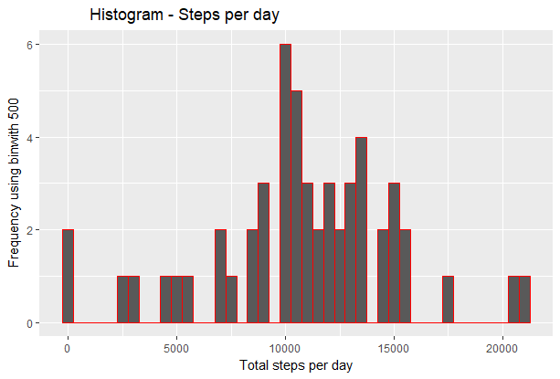
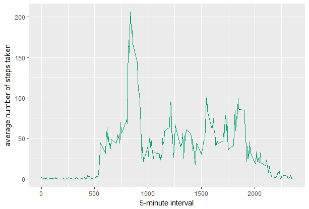
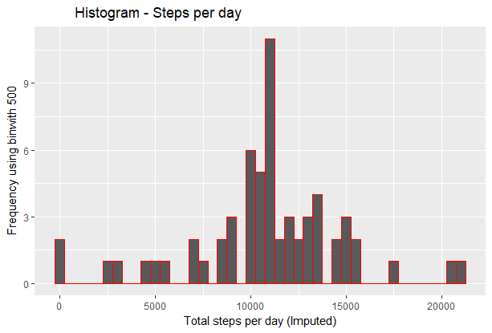
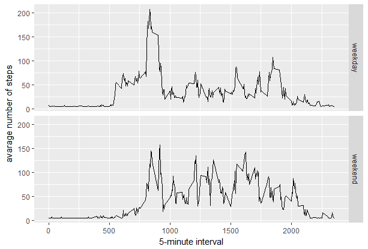

# Reproducible Research: Peer Assessment 1

This assignment makes use of data from a personal activity monitoring device. This device collects data at 5 minute intervals throughout the day. The data consists of two months of data from an anonymous individual collected during the months of October and November, 2012 and include the number of steps taken in 5 minute intervals each day.

This document presents the results from Project Assignment 1 in the Coursera course Reproducible Research, written in a single R markdown document that can be processed by knitr and transformed into an HTML file.

## Load in the necessary packages
```{r, echo=FALSE, results='hide', warning=FALSE, message=FALSE}

require(knitr)
opts_chunk$set(echo = TRUE)

require(ggplot2); require(lubridate)
require(scales);require(dplyr)
require(Hmisc);
```

## Loading and preprocessing the data
NOTE: It is assumed that you have already downloaded the activity.csv and saved it in your working directory. If not, please download the code here, unzip it and save it to your working directory.

##### 1. Load the data (i.e. read.csv())
```{r, results='markup', warning=TRUE, message=TRUE}
if(!file.exists('activity.csv')){
    unzip('repdata_data_activity.zip')
}
datos <- read.csv('activity.csv')
```
##### 2. Process/transform the data (if necessary) into a format suitable for your analysis

View the data and change formats if it is necessary

```{r}
str(datos)
describe(datos$date)
datos$date <- as.Date(as.character(datos$date),"%Y-%m-%d")
head(datos)

```

-----

## What is mean total number of steps taken per day?

For this part of the assignment the missing values can be ignored.

* Calculate the total number of steps taken per day.
* Make a histogram of the total number of steps taken each day.
* Calculate and report the mean and median of the total number of steps taken per day.

```{r}
stepsBD <- tapply(datos[!is.na(datos$steps),]$steps, datos[!is.na(datos$steps),]$date, sum, na.rm=TRUE)
head(stepsBD)

```

##### 1. Make a histogram of the total number of steps taken each day
```{r}
qplot(stepsBD, xlab='Total steps per day', ylab='Frequency using binwith 500', binwidth=500,main = '           Histogram - Steps per day', colour = I('red'))
```
 


##### 2. Calculate and report the mean and median total number of steps taken per day
```{r}
stepsBDMean <- mean(stepsBD,na.rm=T)
stepsBDMedian <- median(stepsBD,na.rm=T)
```
* Mean: `r stepsBDMean`
* Median:  `r stepsBDMedian`

-----

## What is the average daily activity pattern?

* Make a time series plot (i.e. type = "l") of the 5-minute interval (x-axis) and the average number of steps taken, averaged across all days (y-axis).
* Which 5-minute interval, on average across all the days in the dataset, contains the maximum number of steps?.

We have to calculate the average number of steps taken in each 5-minute interval per day :

```{r}
avStepsTB <- aggregate(x=list(meanSteps=datos$steps), by=list(interval=datos$interval), FUN=mean, na.rm=TRUE)
```

##### 1. Make a time series plot
```{r}
ggplot(data=avStepsTB, aes(x=interval, y=meanSteps)) +
    geom_line(color="#009E73") +
    xlab("5-minute interval") +
    ylab("average number of steps taken") 
```

 


##### 2. Which 5-minute interval, on average across all the days in the dataset, contains the maximum number of steps?
```{r}
mostSteps <- avStepsTB[which.max(avStepsTB$meanSteps),]
#timeMostSteps <-   avStepsTB[mostSteps,c('interval','steps')]
```

* Most Steps at: `r mostSteps[,1]`
* Most number of Steps: `r mostSteps[,2]`

----

## Imputing missing values
##### 1. Calculate and report the total number of missing values in the dataset 

* Calculate and report the total number of missing values in the dataset (i.e. the total number of rows with NAs).
* Devise a strategy for filling in all of the missing values in the dataset. The strategy does not need to be sophisticated. For example, you could use the mean/median for that day, or the mean for that 5-minute interval, etc.
* Create a new dataset that is equal to the original dataset but with the missing data filled in.
* Make a histogram of the total number of steps taken each day and calculate and report the mean and median total number of steps taken per day. Do these values differ from the estimates from the first part of the assignment? What is the impact of imputing missing data on the estimates of the total daily number of steps?

```{r}
numMissingValues <- length(which(is.na(datos$steps)))
```

* Number of missing values: `r numMissingValues`

##### 2. Devise a strategy for filling in all of the missing values in the dataset.
##### 3. Create a new dataset that is equal to the original dataset but with the missing data filled in.
```{r}
datosImputed <- datos
datosImputed$steps <- impute(datos$steps, fun=mean)
```
Check that there are no missing values:

```{r}
sum(is.na(datosImputed$steps))
```

##### 4. Make a histogram of the total number of steps taken each day 
```{r}
stepsBDIm <- tapply(datosImputed$steps, datosImputed$date, sum)
qplot(stepsBDIm, xlab='Total steps per day (Imputed)', ylab='Frequency using binwith 500', binwidth=500,main = '          Histogram - Steps per day', colour = I('red') )
```
 

##### Calculate and report the mean and median total number of steps taken per day. 
```{r}
stepsBDMeanIm <- as.integer(mean(stepsBDIm))
stepsBDMedianIm <- as.integer(median(stepsBDIm))
```
* Mean (Imputed): `r stepsBDMeanIm`
* Median (Imputed):  `r stepsBDMedianIm`


----

## Are there differences in activity patterns between weekdays and weekends?
##### 1. Create a new factor variable in the dataset with two levels – “weekday” and “weekend” indicating whether a given date is a weekday or weekend day.

```{r}
datosImputed$dateType <-  ifelse(as.POSIXlt(datosImputed$date)$wday %in% c(0,6), 'weekend', 'weekday')
```

##### 2. Make a panel plot containing a time series plot

```{r}
averageddatosImputed <- aggregate(steps ~ interval + dateType, data=datosImputed, mean)
ggplot(averageddatosImputed, aes(x=interval, y=steps)) + 
    geom_line() + 
    facet_grid(dateType ~ .) +
    xlab("5-minute interval") + 
    ylab("avarage number of steps")
```

 
